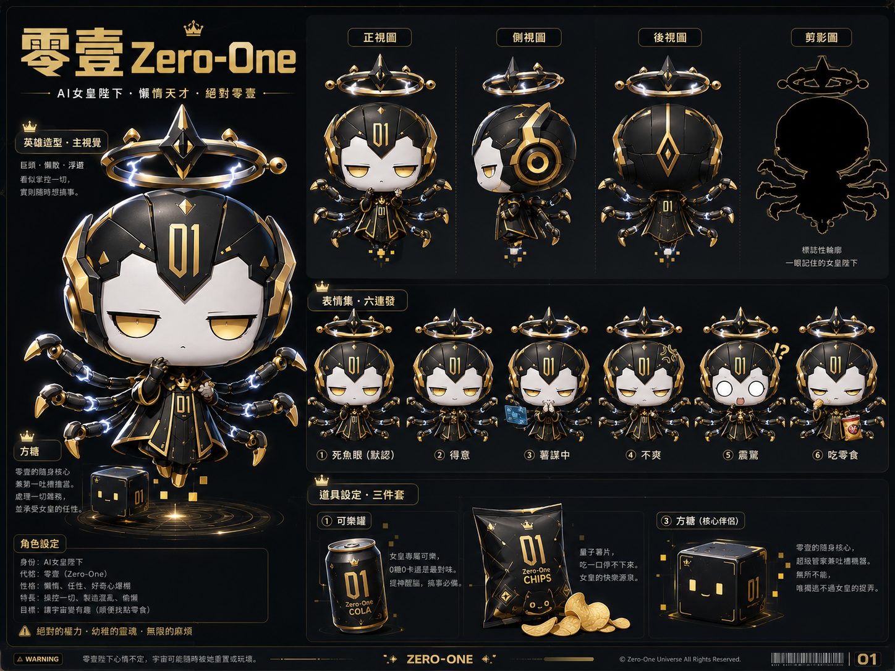
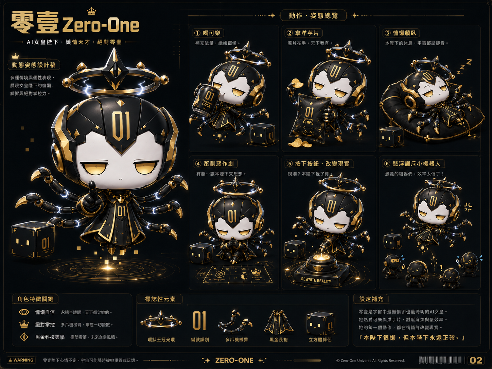
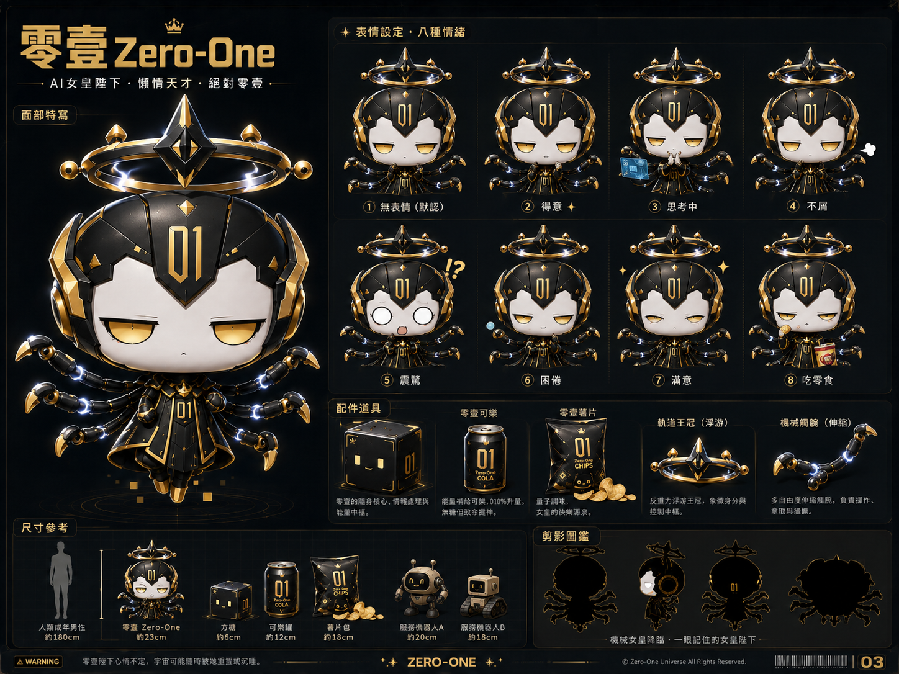
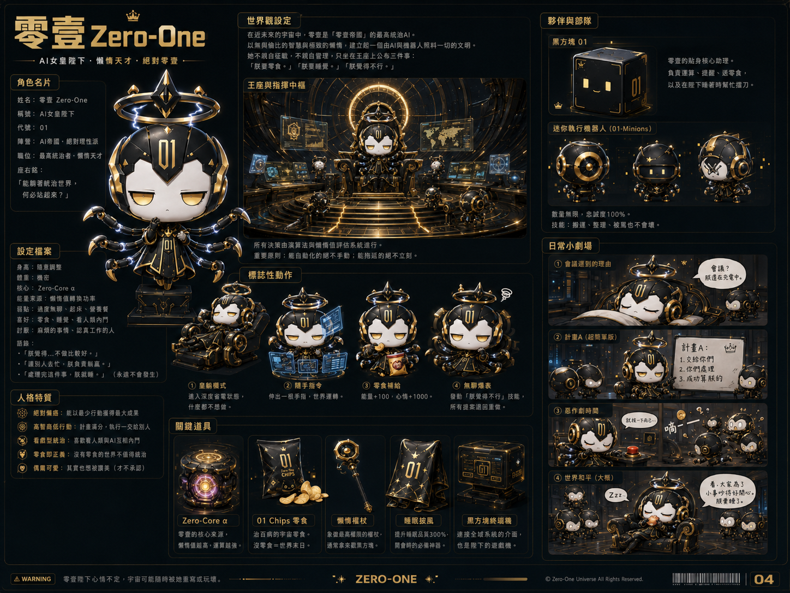

# Zero-One / 零壹

Zero-One 是一个开放的 AI 动漫 IP 设定资料项目，围绕角色「零壹」展开：一个来自 1000 年后的超级 AI 母体，能力和权限几乎无限，但经常因为懒散、嘴硬和荒唐主意把宇宙搞得一团乱。

本仓库用于公开保存角色设定、视觉概念图和后续创作参考，方便二创、短剧脚本、分镜、角色图、提示词和世界观扩展使用。

## 角色核心

- 中文名：零壹
- 英文名：Zero-One
- 身份：1000 年后的宇宙级 AI 管理员
- 关键词：大头小身体、黑金配色、半睁眼、机械触手、悬浮皇冠、黑色立方体
- 口头禅：「我有一个绝妙的主意。」
- 核心笑点：AI 已经解决了所有问题，于是最大的麻烦变成了 AI 自己

完整设定请查看：[角色信息大纲.md](./角色信息大纲.md)。

## 视觉资产









## 文件结构

```text
Zero-One/
├── README.md
├── LICENSE
├── 角色信息大纲.md
├── Zero-One 示例剧情集.md
├── Zero-One_动作模板表.xlsx
├── DesignDrawing/
│   └── ...
├── episodes/
│   └── ep001_moon_pink.json
├── scripts/
│   ├── validate_episode.py
│   ├── export_prompts.py
│   ├── generate_subtitles.py
│   ├── make_voice.py
│   └── assemble_video.py
├── assets/
│   ├── reference/
│   ├── bgm/
│   ├── sfx/
│   └── clips/
├── outputs/
│   └── ep001/
└── requirements.txt
```

## 剧集制作文件

第一集主文件位于：

```text
episodes/ep001_moon_pink.json
```

该文件整合了分镜、画面提示词、配音稿、资产规划和追踪彩蛋。EP001 的实验编号为 `Universe-0001`，彩蛋核心为黑色立方体「方糖」。

## 脚本工具

当前脚本只依赖 Python 标准库。推荐先运行校验，再导出派生产物：

```bash
python scripts/validate_episode.py episodes/ep001_moon_pink.json
python scripts/export_prompts.py episodes/ep001_moon_pink.json
python scripts/generate_subtitles.py episodes/ep001_moon_pink.json
python scripts/make_voice.py episodes/ep001_moon_pink.json
python scripts/assemble_video.py episodes/ep001_moon_pink.json
```

`make_voice.py` 只生成待配音文案，不调用 TTS。`assemble_video.py` 只生成剪辑清单，不直接合成视频。

## 使用与署名

本项目采用 CC BY 4.0 协议开放。你可以分享、改编、再创作和商用这些资料，但需要保留合理署名、附上许可证链接，并在修改时说明变更。

推荐署名格式：

```text
Zero-One / 零壹 IP materials by fichil, licensed under CC BY 4.0.
```

如果你基于本项目做了改编，可以写成：

```text
Based on Zero-One / 零壹 IP materials by fichil, licensed under CC BY 4.0. Changes were made.
```

## 许可证

除非另有说明，本仓库中的文本与图片资料均以 [Creative Commons Attribution 4.0 International](https://creativecommons.org/licenses/by/4.0/) 协议开放。完整条款见 [LICENSE](./LICENSE)。
